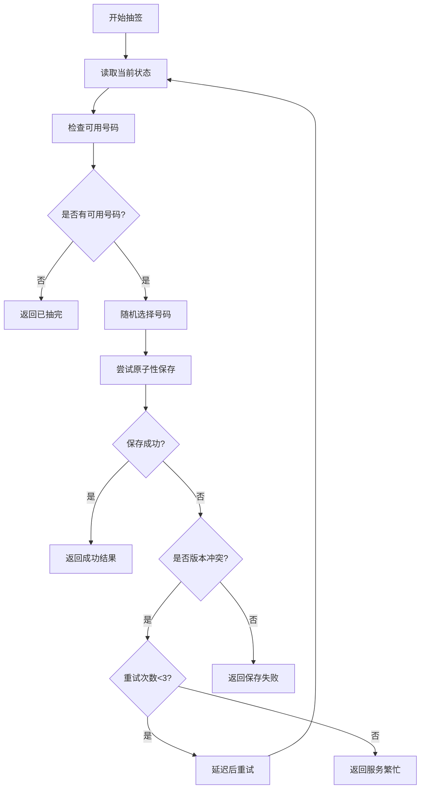

# 🔒 并发控制机制

## 🚨 并发问题分析

### 原有问题
在多人同时抽签时，原有代码存在严重的竞态条件：

```
用户A: 读取状态 → 可用号码[1,2,3] → 选择号码2 → 准备保存
用户B: 读取状态 → 可用号码[1,2,3] → 选择号码2 → 先保存成功  
用户A: 保存状态 → 覆盖用户B的数据 → 号码2被重复分配
```

## ✅ 解决方案

### 1. 乐观锁机制
使用版本号进行乐观锁控制：
- 每次读取时获取当前版本号
- 保存时检查版本号是否发生变化
- 如果版本号改变，说明有其他用户已经修改数据

### 2. 原子性操作
```javascript
// 原子性保存函数
async function atomicSaveState(newState, expectedVersion) {
    // 1. 检查版本号
    const currentState = await readState();
    if (currentState.version !== expectedVersion) {
        return { success: false, conflict: true };
    }
    
    // 2. 原子性写入
    const response = await fetch(FIREBASE_URL, {
        method: 'PUT',
        body: JSON.stringify({
            ...newState,
            version: expectedVersion + 1
        })
    });
    
    return { success: response.ok };
}
```

### 3. 重试机制
- 最大重试次数：3次
- 随机延迟：100-150ms
- 指数退避：避免雷群效应

### 4. 并发控制流程



## 🔧 核心改进

### 1. 版本控制
```javascript
// 数据结构添加版本号
{
  "drawnNumbers": [1, 5, 12],
  "participants": [...],
  "version": 15,        // 版本号
  "lastUpdate": "..."   // 最后更新时间
}
```

### 2. 冲突检测
```javascript
// 检测并发冲突
if (currentState.version !== expectedVersion) {
    console.log(`版本冲突: 期望=${expectedVersion}, 实际=${currentState.version}`);
    return { success: false, conflict: true };
}
```

### 3. 智能重试
```javascript
// 带随机延迟的重试机制
for (let attempt = 1; attempt <= MAX_RETRY_ATTEMPTS; attempt++) {
    const result = await performDraw();
    if (result.success) return result;
    
    if (result.conflict && attempt < MAX_RETRY_ATTEMPTS) {
        // 随机延迟避免同时重试
        await delay(RETRY_DELAY_MS + Math.random() * 50);
        continue;
    }
}
```

## 📊 性能优化

### 1. 减少网络请求
- 在一次事务中完成读取-检查-写入
- 避免不必要的状态查询

### 2. 智能退避
- 第1次重试：100-150ms延迟
- 第2次重试：150-200ms延迟
- 第3次重试：200-250ms延迟

### 3. 错误分类处理
```javascript
// 不同错误类型的状态码
switch (errorCode) {
    case 'LOTTERY_FULL': return 400;     // 客户端错误
    case 'MAX_RETRIES_EXCEEDED': return 503; // 服务不可用
    case 'SAVE_FAILED': return 500;      // 服务器错误
}
```

## 🧪 测试场景

### 并发测试用例
1. **双人同时抽签** - 确保不会抽到相同号码
2. **多人快速连续抽签** - 验证重试机制
3. **网络延迟情况** - 模拟慢网络环境
4. **边界条件** - 最后一个号码的并发抽取

### 预期行为
- ✅ 绝不出现重复号码
- ✅ 高并发下系统稳定
- ✅ 适当的用户反馈（重试提示）
- ✅ 优雅的错误处理

## ⚡ 用户体验

### 成功情况
```json
{
  "success": true,
  "number": 5,
  "message": "抽签成功（经过2次尝试）",
  "attempts": 2
}
```

### 冲突情况  
```json
{
  "success": false,
  "message": "服务器繁忙，请稍后重试",
  "code": "MAX_RETRIES_EXCEEDED"
}
```

## 🎯 总结

通过实施以上并发控制机制：

1. **数据一致性** - 杜绝重复抽号问题
2. **系统稳定性** - 高并发下正常工作
3. **用户体验** - 透明的重试机制
4. **可扩展性** - 支持更多并发用户

现在系统可以安全处理多人同时抽签的场景！🎉